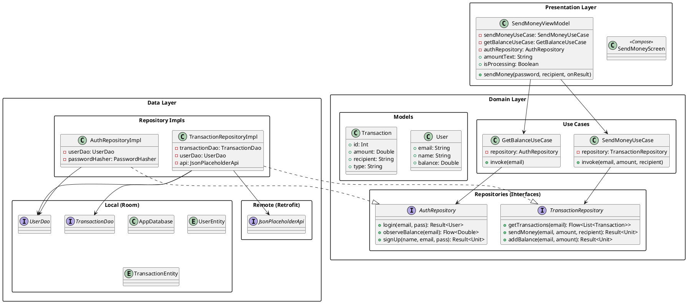
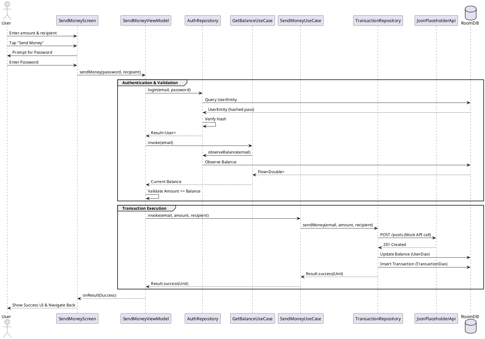

# Architecture Diagrams

This document contains the architectural diagrams for the Send Money Demo App, illustrating the Clean Architecture implementation and key business flows.

## Class Diagram
This diagram shows the relationship between the Presentation, Domain, and Data layers, following Clean Architecture principles.
(Source: [docs/architecture.puml](./docs/architecture.puml))

## Sequence Diagram: Send Money Flow
This diagram illustrates the sequence of operations when a user initiates a money transfer.
(Source: [docs/send_money_sequence.puml](./docs/send_money_sequence.puml))

